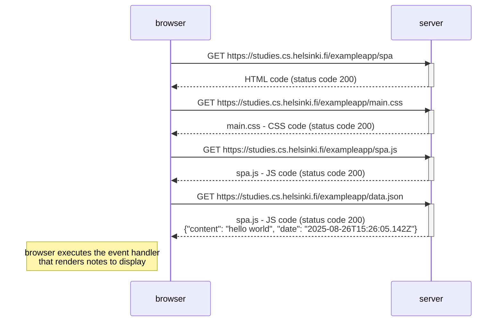

```mermaid
sequenceDiagram
    participant browser
    participant server

    browser->>server: GET https://studies.cs.helsinki.fi/exampleapp/spa
    activate server
    server-->>browser: HTML code (status code 200)
    deactivate server
  
    browser->>server: GET https://studies.cs.helsinki.fi/exampleapp/main.css
    activate server
    server-->>browser: main.css - CSS code (status code 200)
    deactivate server

    browser->>server: GET https://studies.cs.helsinki.fi/exampleapp/spa.js
    activate server
    server-->>browser: spa.js - JS code (status code 200)
    deactivate server

    browser->>server: GET https://studies.cs.helsinki.fi/exampleapp/data.json
    activate server
    server-->>browser: spa.js - JS code (status code 200) <br> {"content": "hello world", "date": "2025-08-26T15:26:05.142Z"}
    deactivate server

    Note left of browser: browser executes the event handler<br> that renders notes to display

```