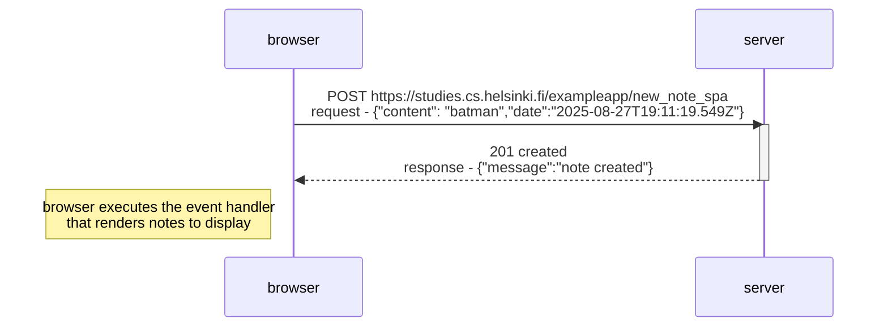

```mermaid
sequenceDiagram

participant browser
participant server

browser->>server: POST https://studies.cs.helsinki.fi/exampleapp/new_note_spa <br> request - {"content": "batman","date":"2025-08-27T19:11:19.549Z"}

activate server
server-->>browser: 201 created <br> response - {"message":"note created"}
deactivate server

Note left of browser: browser executes the event handler<br> that renders notes to display

```